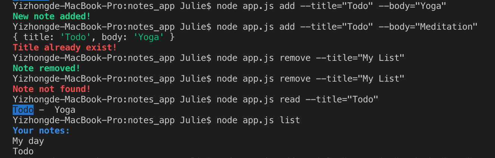

# Notes App

An app that allows users to add notes/remove notes from a list with NodeJS.

## To install and run the code:

1. Fork the repo
2. Run `$ npm install`
3. Run commands in terminal

## To interact with the code:

1. Add a note: `$ node app.js add --title="Todo" --body="Yoga"`
2. Remove a note: `$ node app.js remove --title="Todo"`
3. Read a note: `$ node app.js read --title="Todo"`
4. List all the notes: `$ node app.js list`

See the example:

## Tools: 
1. chalk
2. yargs
